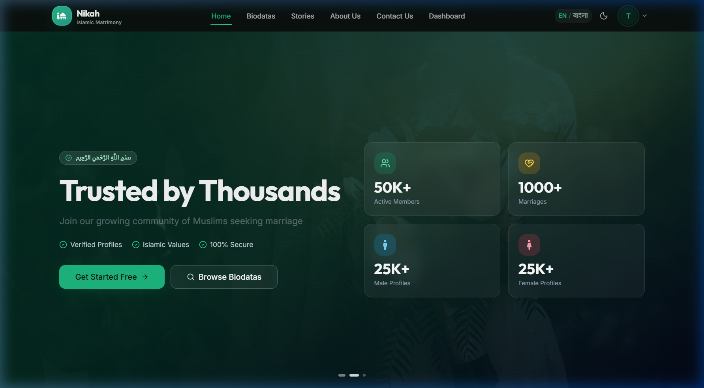
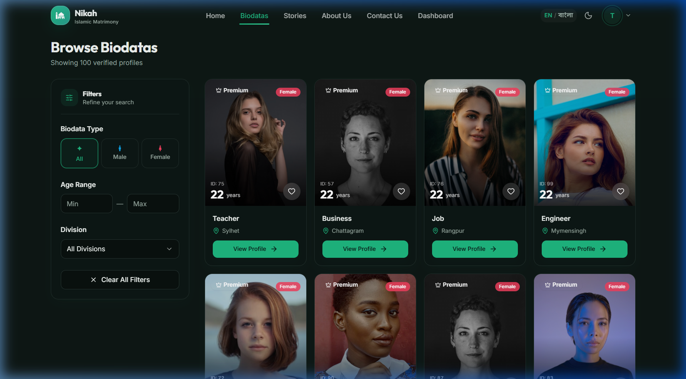
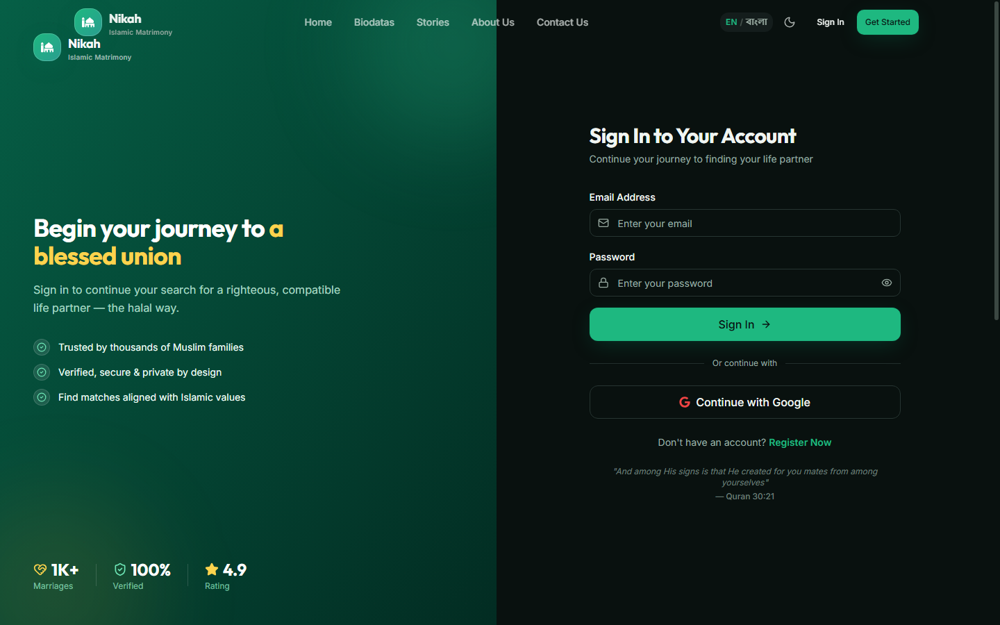
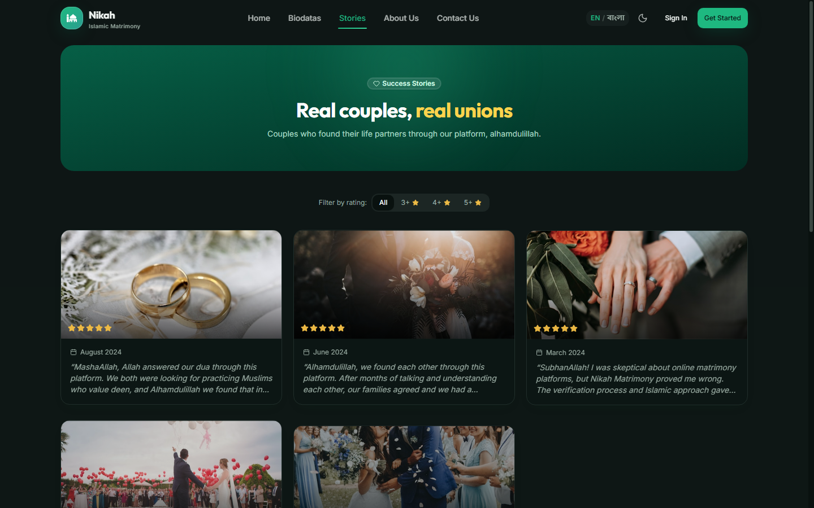
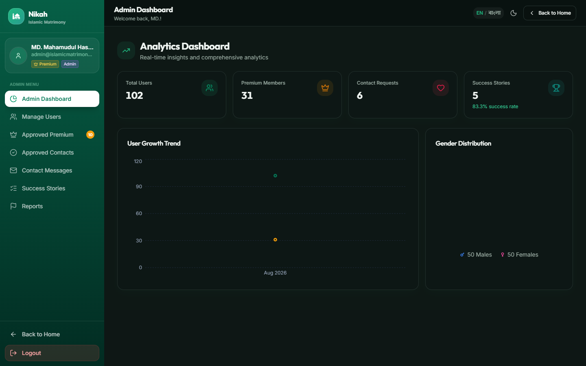
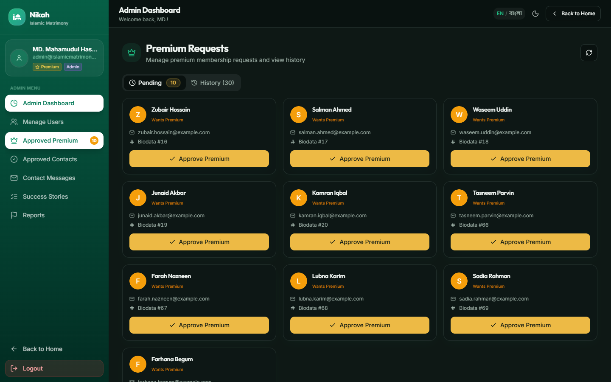
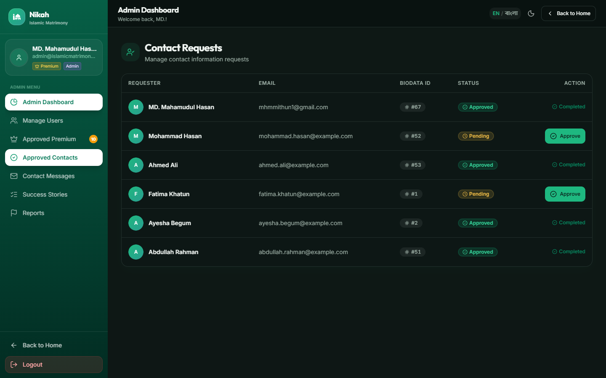

# 💍 Nikah Matrimony — Islamic Matrimony Platform (Full-Stack MERN)

<div align="center">



### A Modern, Secure, and Halal Matrimony Platform Connecting Muslims Worldwide

[](https://react.dev/)
[](https://nodejs.org/)
[](https://expressjs.com/)
[](https://www.mongodb.com/)
[](https://tailwindcss.com/)
[](https://firebase.google.com/)
[](https://stripe.com/)
[](https://github.com/MHMITHUN/Islamic-Matrimony-Website-Using-MERN-)

</div>

---

## 🌐 Live Demo

<div align="center">

| Deployment | Platform | URL |
| :--- | :--- | :--- |
| 🖥️ **Frontend** | Netlify | [islamic-nikah-website.netlify.app](https://islamic-nikah-website.netlify.app/) |
| ⚙️ **Backend API** | Vercel | [islamic-matrimony-website-using-mer.vercel.app](https://islamic-matrimony-website-using-mer.vercel.app/) |

</div>

---

## 🌟 Overview

**Nikah Matrimony** is a full-stack MERN (MongoDB, Express, React, Node.js) web application engineered to facilitate Islamic marriage matching in a safe, verified, and Halal manner. The platform offers seamless bilingual internationalization (English & Bangla), dynamic theme toggling (Dark/Light mode), verified biodata profiles, Stripe payment integration for contact requests, and a comprehensive admin management dashboard.

---

## 📸 Screenshots & Visual Tour

### 🌐 User Experience & Public Features

<div align="center">

#### 🏠 Home Page (Hero & Quick Search)


#### 📋 Verified Biodata Directory & Filters


#### 👤 Biodata Profile Details


#### 💳 Secure Checkout & Payment Processing


#### 💍 Real Success Stories


</div>

---

### 👨‍💼 Admin Management Panel

<div align="center">

#### 📊 Admin Real-time Analytics & Dashboard Metrics


#### 👑 Approved Premium Members & Requests


#### 💳 Approved Contact Requests & Approvals


</div>

---

## ✨ Key Features

### 🌐 Internationalization (i18n) & Localization
- **Instant Language Switcher**: Dynamically toggle between **English** and **Bangla (বাংলা)** across all components, navigation items, cards, forms, and alerts.
- **Formatted Values**: Localized date formats, numbers, and currency formatting (`500 BDT`).

### 👥 User Features
- **🔐 Firebase & JWT Authentication**: Email/Password and Google Social Login with JWT token verification.
- **📝 Comprehensive Biodata Management**: Create, view, update, and manage personal, familial, educational, and preference data.
- **🔍 Advanced Search & Multi-filter**: Search by gender, age range, division/location, and occupation.
- **💖 Favorites & Likes**: Bookmark profiles and manage favorite lists in user dashboard.
- **📧 Contact Request System**: Request verified contact details of candidates.
- **💳 Stripe Payment Gateway**: Secure 500 BDT payment processing to request contact information.
- **🌙 Dark / Light Mode**: Beautiful glassmorphism aesthetic tailored for day or night viewing.

### 👨‍💼 Admin Management Panel
- **📊 Real-time Analytics**: Interactive stats for total profiles, male/female ratios, premium requests, and revenue.
- **✅ Biodata Approvals**: Review, approve, or reject newly submitted biodatas.
- **👑 Premium & Contact Approval**: Approve contact request payments and grant premium member status.
- **📖 Success Story Curation**: Publish, edit, and moderate happy couples' success stories.
- **👥 User Role Control**: Easily elevate users to Admin status or manage access permissions.

---

## 🏗️ Architecture & Diagrams

The system architecture and process flows are documented with formal Software Design Patterns (SDP) diagrams located in the `Image_and_Diagrams/` directory:

| Diagram Type | Description | File Path |
| :--- | :--- | :--- |
| **Data Flow Diagram (DFD Level 0)** | System context and external entities interaction | [`Context Level Diagram (DFD-0).png`](Image_and_Diagrams/Context%20Level%20Diagram%20(DFD-0).png) |
| **Use Case Diagram** | User and Admin role interactions | [`SDP_Use_Case_Diagram.png`](Image_and_Diagrams/SDP_Use_Case_Diagram.png) |
| **Entity Relationship (ER) Diagram** | Database schema and relational structure | [`SDP_ER_DIAGRAM.png`](Image_and_Diagrams/SDP_ER_DIAGRAM.png) |
| **Sequence Diagram** | Payment and Contact Request execution flow | [`SDP_Sequence_Diagram.png`](Image_and_Diagrams/SDP_Sequence_Diagram.png) |
| **Activity Diagram** | Step-by-step user onboarding & matching workflow | [`SDP_Activity_Diagram.png`](Image_and_Diagrams/SDP_Activity_Diagram.png) |
| **Project Timeline** | Gantt chart and release milestone structure | [`SDP_Projecr_Timeline.png`](Image_and_Diagrams/SDP_Projecr_Timeline.png) |

---

## 🛠️ Tech Stack

### Frontend (`/client`)
- **Framework**: React 18, Vite
- **Styling & UI**: Vanilla CSS Design System, Tailwind CSS, DaisyUI, Framer Motion
- **Icons**: Lucide React, React Icons
- **State & Query**: TanStack Query (React Query v5), React Context API
- **Auth**: Firebase Auth, JWT Client Decoding
- **Notifications**: React Hot Toast
- **SEO & Meta**: React Helmet Async

### Backend (`/server`)
- **Runtime**: Node.js, Express.js
- **Database**: MongoDB Atlas with Mongoose ODM
- **Authentication**: JWT (JSON Web Tokens), Firebase Admin SDK
- **Payment Processing**: Stripe Node SDK
- **Security**: Cors, Dotenv

---

## 📂 Project Structure

```
Nikah website SDP-4/
├── client/                     # Frontend Application (React + Vite)
│   ├── src/
│   │   ├── api/                # Axios API Endpoints
│   │   ├── components/         # Shared UI & Layout Components
│   │   ├── contexts/           # AuthContext & LanguageContext (i18n)
│   │   ├── i18n/               # en.json & bn.json Localization Files
│   │   ├── pages/              # Home, Stories, Biodatas, Checkout, Auth, Dashboard
│   │   └── providers/          # React Query & Theme Providers
│   ├── package.json
│   └── vite.config.js
│
├── server/                     # Backend API (Node.js + Express)
│   ├── config/                 # DB Connection Setup
│   ├── middleware/             # verifyToken & verifyAdmin Middlewares
│   ├── models/                 # Mongoose Schemas (User, Biodata, SuccessStory, Payment)
│   ├── routes/                 # Express REST Endpoints
│   ├── seed.js                 # Database Seeding Script
│   ├── index.js                # Express App Server Entry Point
│   └── package.json
│
├── screenshots/                # Application Screenshots
├── Image_and_Diagrams/         # Architectural DFD, ERD & Sequence Diagrams
├── README.md                   # Project Documentation
└── package.json
```

---

## 🚀 Getting Started Guide

### Prerequisites
- **Node.js**: v18.x or higher
- **npm**: v9.x or higher
- **MongoDB**: Local MongoDB server or MongoDB Atlas URI
- **Firebase Account**: For Auth credentials
- **Stripe Account**: For test payment secret keys

### 1️⃣ Installation

```bash
# Clone the repository
git clone https://github.com/MHMITHUN/Islamic-Matrimony-Website-Using-MERN-.git
cd Islamic-Matrimony-Website-Using-MERN-

# Install Root dependencies
npm install

# Install Frontend dependencies
cd client
npm install

# Install Backend dependencies
cd ../server
npm install
```

### 2️⃣ Environment Setup

#### Server `.env` (`/server/.env`)
```env
PORT=5000
MONGODB_URI=mongodb+srv://<username>:<password>@cluster0.mongodb.net/nikah_db
JWT_SECRET=your_super_secret_jwt_key
STRIPE_SECRET_KEY=sk_test_your_stripe_secret_key
```

#### Client `.env` (`/client/.env`)
```env
VITE_API_URL=http://localhost:5000/api
VITE_FIREBASE_API_KEY=your_firebase_api_key
VITE_FIREBASE_AUTH_DOMAIN=your_firebase_auth_domain
VITE_FIREBASE_PROJECT_ID=your_firebase_project_id
VITE_FIREBASE_STORAGE_BUCKET=your_firebase_storage_bucket
VITE_FIREBASE_MESSAGING_SENDER_ID=your_firebase_messaging_sender_id
VITE_FIREBASE_APP_ID=your_firebase_app_id
VITE_STRIPE_PUBLISHABLE_KEY=pk_test_your_stripe_publishable_key
```

### 3️⃣ Database Seeding (Optional)

To seed initial users, admin profile, 100 sample biodatas, and success stories:
```bash
cd server
node seed.js
```

### 4️⃣ Running the Application

In separate terminal windows:

```bash
# Start Backend API (Port 5000)
cd server
npm run dev

# Start Frontend App (Port 5173 / 5174)
cd client
npm run dev
```

---

## 🔑 Admin Credentials (Demo Testing)

You can explore the full administrative features (Approval workflows, Analytics, User Management) using these seed credentials:

- **Email**: `admin@islamicmatrimony.com`
- **Password**: `Admin@123`

---

## 🔌 Key API Endpoints Overview

| Method | Endpoint | Access Level | Description |
| :--- | :--- | :--- | :--- |
| `POST` | `/api/auth/jwt` | Public | Issue JWT token after Firebase authentication |
| `GET` | `/api/biodatas` | Public | Get paginated biodata list with search filters |
| `GET` | `/api/biodatas/:id` | Private | Get detailed profile of a single biodata |
| `POST` | `/api/contact-request` | Private | Submit a contact details request |
| `POST` | `/api/payments/create-intent` | Private | Initialize Stripe payment intent |
| `GET` | `/api/admin/stats` | Admin | Fetch aggregate platform metrics and financial stats |
| `PATCH` | `/api/admin/approve-premium/:id` | Admin | Approve pending premium membership request |

---

## 👨‍💻 Authors & Contributors

<div align="center">

| Author | Role | GitHub |
| :--- | :--- | :--- |
| **Mohammad Mithun** | Lead Full-Stack Developer | [@MHMITHUN](https://github.com/MHMITHUN) |
| **Sumya Soma** | Co-Author & Core Contributor | [@sumyasoma](https://github.com/sumyasoma) |

</div>

---

<div align="center">

Designed & Developed with ❤️ for the Muslim Community.  
© 2026 **Team Islamic Matrimony Website**. All Rights Reserved.

</div>
